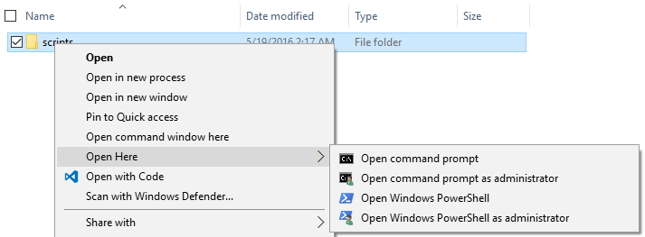

# PS-OPEN-HERE
A powershell script to generate the menu "Open Here" for Directory, Folder and Drive objects in Explorer (see listing 1).

*Listing 1*

## Setup
Using powershell, run [ps-open-here.ps1](ps-open-here.ps1).

`ps>./ps-open-here.ps1`